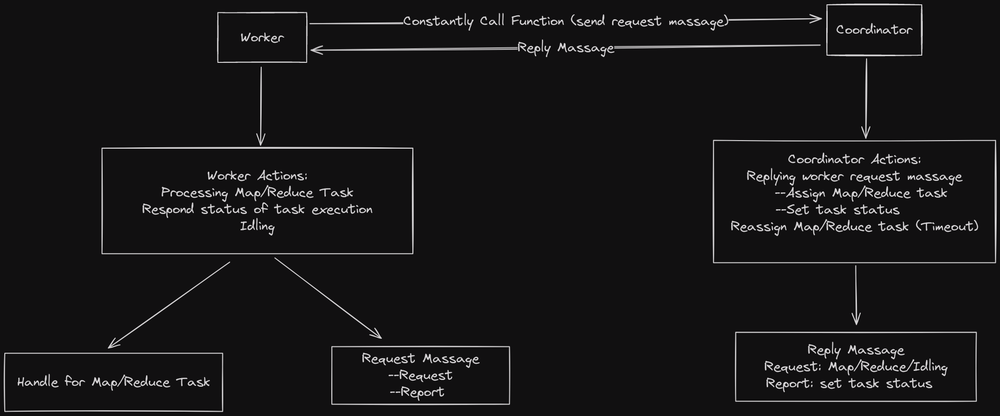

# Lab 1

- [Lab 1](#lab-1)
  - [Prerequisite](#prerequisite)
  - [Design](#design)
    - [Worker Actions](#worker-actions)
    - [Coordinator Actions](#coordinator-actions)
    - [Architecture](#architecture)
  - [Implementation](#implementation)
    - [Coordinator](#coordinator)
      - [Definition](#definition)
      - [Request \& Response Message](#request--response-message)
    - [Worker](#worker)
      - [Map/Reduce Task](#mapreduce-task)
      - [Main Function](#main-function)
    - [Summary](#summary)


## Prerequisite

在具体开始写代码之前需要先将官方提供的 [实验文档](https://pdos.csail.mit.edu/6.824/labs/lab-mr.html) 全部认真看一遍，除此之外还需要详细理解 [`MapReduce`](https://pdos.csail.mit.edu/6.824/papers/mapreduce.pdf) 的原理，否者这个实验无法进行下去

这个实验的难点在于 `Master/Coordinator` 与 `Worker` 之间需要交流哪些信息以及 `Coordinator` 需要维护哪些信息。由于实验只给出了最基本的 `RPC` 调用示例，关于 `MapReduce` 的部分几乎没有代码，因此可以自由发挥的空间十分的大（~~换句话说，也就是无从下手~~）

## Design 

### Worker Actions

对于 `Worker` 而言：

- 向 `Coordinator` 请求任务
- 执行 `Map/Reduce Task` 或者处于空闲状态
- 向 `Coordinator` 报告 `Task` 是否执行完毕

`Worker` 的行为有两种：请求任务和报告信息，因此 `Coordinator` 需要提供两个函数供 `Worker` 调用

关于 `Map Task` 和 `Reduce Task`：

- 由于本实验的输入文件全部给出，因此我们不需要按照论文当中说的对输入文件进行分割
- `Coordinator` 通过将输入文件名发送给 `Worker`，之后 `Worker` 便可以读取该文件  
- `Map Task` 的数量是固定的，就是输入文件数；而 `Reduce Task` 则可以由用户进行指定（在 `mrcoordinator.go` 中）
- 假设 `Map Task` 的数量为 $X$，`Reduce Task` 的数量为 $Y$，那么会产生的中间文件个数为 $XY$，每个中间文件用 `mr-i-y` 表示（这里 `i` 表示 `Map Task` 的编号，`j` 表示 `Reduce Task` 的编号）
- 对于编号为 $y$ 的 `Reduce Task` 而言，它需要读取所有 `mr-i-j` 的文件
- 对于每个中间文件，我们可以使用 `os.CreateTemp` **在当前路径**创建临时文件，**对文件写入完毕后**使用 `os.Rename` 来对其进行原子重命名
  - 在我最开始的实现中，我直接使用 `os.Create` 来创建一个新文件，然后对文件进行写入。但这种设计存在问题，因为如果两个不同的 `Worker` 执行同一个 `Map Task`，那么它们产生的中间文件就会同名，这时同一个文件就会被两个 `Worker` 进行写入
  - 而我们使用临时文件加原子重命名这种方式则可以避免这个问题，因为我们总是在文件写入完毕后对其重命名，因此哪怕有两个相同的 `Worker` 执行同一个 `Map Task`，最终的结果也只会生成一个文件，并且不存在两个 `Worker` 都向这个文件写入的情况


### Coordinator Actions

对于 `Coordinator` 而言：

- 响应 `Worker` 的请求，向其分配 `Task`，并记录信息
- 对于超时的 `Task`，重新分配一遍

由于我们采用 `RPC` 来实现通信，因此 `Worker` 通过**不断调用（也就是轮询）** `Coordinator` 暴露出来的函数来交流信息。由于这个过程中存在多个 `Worker` 同时执行函数，因此 `Coordinator` 需要加锁保护数据

需要说明的是，`RPC` 所使用的消息的输入参数和回复参数当中的字段都需要大写，不然无法读取到正确的数据

`Coordinator` 需要记录每个 `Task` 的执行情况，对于那些超时未完成的 `Task`，需要重新分配一遍

- 在我的设计中，`Worker` 每隔 `5` 秒向 `Coordinator` 报告一次执行情况用于更新 `Task` 的时间戳
- 如果 `Coordinator` 发现某个 `Task` 的时间戳于当前时间戳超过 `10` 秒，那么认为原先执行该 `Task` 的 `Worker` 已经 `Crash`，直接重新分配该任务

### Architecture

最后给出整体的框架图：

实现代码：[Code](https://github.com/NishikiChisato/MIT6.5840)



## Implementation

这里给出详细的实现细节

### Coordinator

#### Definition

我们首先需要定义一些常量用于表示 `Task` 的状态和类型

```go
type TaskStatus int
type TaskType int

const (
	// Task status
	NotStart TaskStatus = iota
	InProgress
	Completed
)

const (
	// Task type
	NotAssigned TaskType = iota
	MapType
	ReduceType
)

```

`Coordinator` 并不需要记录每个 `Worker` 的状态，因为 `Worker` 仅仅是用于执行不同的任务。如果某个 `Worker` 崩溃了，那么我们只需要重新分配这个 `Task` 给那些可以工作的 `Worker` 执行就好（~~超时重传的机制可以解决一切问题~~）

`Task Type` 并不是只有 `Map` 和 `Reduce`，这是因为一个 `Worker` 可以处于空闲状态，也就是即不执行 `Map` 也不执行 `Reduce`，我们需要用 `NotAssigned` 来进行标识

我们需要记录 `Map Task` 和 `Reduce Task` 的信息，定义如下：

```go
type MapInfo struct {
	// in this lab, we don't need to transport file content to worker.
	// worker read exact file by using its file name.
	// the number of map task is equal to the number of input file
	// the number of reduce task is determined by user
	File_name_ string
	Task_id_   int
	Status_    TaskStatus
	Type_      TaskType
	Timestamp_ time.Time // timestamp for re-assign
}

type ReduceInfo struct {
	Task_id_   int
	Status_    TaskStatus
	Type_      TaskType
	Timestamp_ time.Time // timestamp for re-assign
}
```

如前文所述，`Map Task` 中只需要记录输入的文件名即可，并不需要将文件的内容也包含在内

`Coordinator` 的定义如下：

```go
type Coordinator struct {
	// Your definitions here.
	map_queue_    []*MapInfo
	reduce_queue_ []*ReduceInfo
	latch_        sync.Mutex // mutex for concurrency
	nReduce_      int
	nMap_         int
}
```

由于存在并发问题，我们需要使用 `Mutex` 来保护共享变量。实际上更加 `go style` 的方式是用 `channal`，但我还是习惯去用 `lock`

#### Request & Response Message

`Worker` 需要向 `Coordinator` 请求任务以及向 `Coordinator` 报告任务执行情况，这分别通过调用 `HandleRequest` 和 `HandleRespond` 来实现


我们需要定义如下 `RPC` 的输入参数以及返回值

```go
type RequestArgs struct {
}

type RequestReply struct {
	NMap_        int
	NReduce_     int
	Task_type_   TaskType
	Map_task_    MapInfo
	Reduce_task_ ReduceInfo
}

type ResponseArgs struct {
	Task_types   TaskType
	Map_task_    MapInfo
	Reduce_task_ ReduceInfo
}

type ResponseReply struct {
}
```

由于 `Request` 消息用于请求任务，因此必须包含 `MapInfo` 和 `ReduceInfo` 以及用于标识当前任务的类型

`Worker` 向 `Coordinator` 报告任务执行情况时同样需要包含上面这三个变量，而任务的执行情况则在 `MapInfo` 和 `ReduceInfo` 中

```go
func (c *Coordinator) HandleRequest(args *RequestArgs, reply *RequestReply) error {
	//fmt.Println("Coordinator HandleRequest Call")
	c.latch_.Lock()
	for i, e := range c.map_queue_ {
		//fmt.Printf("[map]: idx: %v\n", i)
		if (e.Status_ == NotStart) || (e.Status_ == InProgress && time.Since(c.map_queue_[i].Timestamp_) > time.Second*10) {
			c.map_queue_[i].Timestamp_ = time.Now()
			c.map_queue_[i].Status_ = InProgress
			reply.Map_task_ = *c.map_queue_[i]
			reply.Task_type_ = MapType
			reply.NMap_ = c.nMap_
			reply.NReduce_ = c.nReduce_
			c.latch_.Unlock()
			return nil
		}
	}

	for i, e := range c.reduce_queue_ {
		//fmt.Printf("[reduce]: idx: %v\n", i)
		if (e.Status_ == NotStart) || (e.Status_ == InProgress && time.Since(c.reduce_queue_[i].Timestamp_) > time.Second*10) {
			c.reduce_queue_[i].Timestamp_ = time.Now()
			c.reduce_queue_[i].Status_ = InProgress
			reply.Reduce_task_ = *c.reduce_queue_[i]
			reply.Task_type_ = ReduceType
			reply.NMap_ = c.nMap_
			reply.NReduce_ = c.nReduce_
			c.latch_.Unlock()
			return nil
		}
	}
	// don't have task to assign
	reply.Task_type_ = NotAssigned
	c.latch_.Unlock()
	return nil
}
```

对于所有未分配的 `Task`，其状态都是 `NotStart`，一旦分配则将其修改为 `InProgress`。除非该 `Task` 完成，否则一直都是 `InProgress`

在分配 `Task` 后，我们需要设置该 `Task` 的时间戳，用于超时重传

```go
func (c *Coordinator) HandleResponse(args *ResponseArgs, reply *ResponseReply) error {
	//fmt.Println("Coordinator HandleRespond Call")
	c.latch_.Lock()
	if args.Task_types == MapType {
		c.map_queue_[args.Map_task_.Task_id_].Timestamp_ = time.Now()
		if args.Map_task_.Status_ == Completed {
			c.map_queue_[args.Map_task_.Task_id_].Status_ = Completed
		}
	}
	if args.Task_types == ReduceType {
		c.reduce_queue_[args.Reduce_task_.Task_id_].Timestamp_ = time.Now()
		if args.Reduce_task_.Status_ == Completed {
			c.reduce_queue_[args.Reduce_task_.Task_id_].Status_ = Completed
		}
	}
	c.latch_.Unlock()
	return nil
}
```

而对于 `Worker` 报告的信息，`Coordinator` 每接收到都需要重新设置该 `Task` 的时间戳，用于表示执行该 `Task` 的 `Worker` 没有崩溃。而如果该 `Task` 执行完毕，那么将其状态修改为 `Completed`


### Worker

相比之下，`Worker` 这边的代码稍显复杂

`Worker` 的行为有：

- 执行 `Map/Reduce Task`
- 报告 `Task` 的执行情况

我们先给出执行 `Map/Reduce Task` 的代码

#### Map/Reduce Task

```go
func MapFunction(req *RequestReply, mapf func(string, string) []KeyValue) bool {
	file, err := os.Open(req.Map_task_.File_name_)
	if err != nil {
		//log.Fatalf("cannot open %v\n", req.Map_task_.File_name_)
		return false
	}
	content, err := ioutil.ReadAll(file)
	if err != nil {
		//log.Fatalf("cannot read %v\n", req.Map_task_.File_name_)
		return false
	}
	file.Close()
	kva := mapf(req.Map_task_.File_name_, string(content))
	groups := map[int][]KeyValue{}
	for _, kv := range kva {
		groups[ihash(kv.Key)%req.NReduce_] = append(groups[ihash(kv.Key)%req.NReduce_], kv)
	}
	// create tmp file list and encoder list
	tfile_list := []*os.File{}
	enc_list := []*json.Encoder{}
	for i := 0; i < req.NReduce_; i++ {
		//tfile, _ := os.Create(tfilename)
		tfile, _ := os.CreateTemp("./", "tmp-mr-")
		defer tfile.Close()
		tfile_list = append(tfile_list, tfile)
		enc_list = append(enc_list, json.NewEncoder(tfile))
	}

	// encode
	for idx, vals := range groups {
		enc := enc_list[idx]
		for _, kv := range vals {
			err := enc.Encode(&kv)
			if err != nil {
				//log.Fatalf("encode error: [file name]: %v\n", tfile_list[idx])
				return false
			}
		}
	}
	for i := 0; i < req.NReduce_; i++ {
		tfilename := fmt.Sprintf("mr-%d-%d", req.Map_task_.Task_id_, i)
		if err := os.Rename(tfile_list[i].Name(), tfilename); err != nil {
			return false
		}
	}
	return true
}
```

关于 `mapf` 的调用可以从 `mrsequential.go` 中偷代码，我们重点需要关注以下几点：

- 对 `mapf` 调用完毕后，我们得到的是 `[]KeyValue`。我们需要对该数组中的元素分配到 `nReduce` 个 `bucket` 中，这里我们使用 `map` 来解决
- 该函数返回值表示 `Map Task` 是否成功执行，`true` 为执行成功，`false` 为执行失败
- 在使用 `os.CreateTemp` 时，第一个参数用于表示临时文件的路径。由于我们在当前文件夹创建临时文件，因此为 `"./"`
- 创建文件的格式为 `json`，这里在官方的文档中有简易的教程

```go
func ReduceFunction(req *RequestReply, reducef func(string, []string) string) bool {
	kva := []KeyValue{}
	for i := 0; i < req.NMap_; i++ {
		ifilename := fmt.Sprintf("mr-%d-%d", i, req.Reduce_task_.Task_id_)
		ifile, err := os.Open(ifilename)
		if err != nil {
			//log.Fatalf("cannot open %v\n", ifilename)
			return false
		}
		dec := json.NewDecoder(ifile)
		for {
			var kv KeyValue
			if err := dec.Decode(&kv); err != nil {
				break
			}
			kva = append(kva, kv)
		}
	}
	sort.Sort(ByKey(kva))
	ofilename := fmt.Sprintf("mr-out-%d", req.Reduce_task_.Task_id_)
	ofile, _ := os.Create(ofilename)
	defer ofile.Close()

	i := 0
	for i < len(kva) {
		j := i + 1
		for j < len(kva) && kva[j].Key == kva[i].Key {
			j++
		}
		values := []string{}
		for k := i; k < j; k++ {
			values = append(values, kva[k].Value)
		}
		output := reducef(kva[i].Key, values)

		// this is the correct format for each line of Reduce output.
		fmt.Fprintf(ofile, "%v %v\n", kva[i].Key, output)

		i = j
	}

	return true
}
```

`Reduce Task` 的执行需要先从中间文件中读取数据。由于每个 `Map Task` 都会产生 `nReduce` 个 `bucket`，因此 `Reduce Task` 需要从**每个 `Map Task` 所产生的中间文件读取对应编号的文件**

全部读取完毕后，需要对其**进行排序**。往后的代码就是复制 `mrsequential.go` 中的了

#### Main Function

我们直接给出 `Worker` 的主要代码，其中 `CallRequest` 和 `CallResponse` 都是一个封装函数，用于调用 `RPC`

```go
func Worker(mapf func(string, string) []KeyValue, reducef func(string, []string) string) {

	// Your worker implementation here.

	// uncomment to send the Example RPC to the coordinator.
	// CallExample()

	var cur_task_type TaskType = NotAssigned
	var success_call atomic.Value
	success_call.Store(false)
	for {
		req := CallRequest()
		cur_task_type = req.Task_type_
		switch cur_task_type {
		case NotAssigned:
			time.Sleep(time.Second)
		case MapType:
			go func() {
				for success_call.CompareAndSwap(false, false) {
					nor_rsp := ResponseArgs{}
					nor_rsp.Task_types = cur_task_type
					nor_rsp.Map_task_ = MapInfo{File_name_: req.Map_task_.File_name_,
						Task_id_: req.Map_task_.Task_id_,
						Status_:  InProgress,
						Type_:    req.Map_task_.Type_}
					CallResponse(&nor_rsp)
					time.Sleep(5 * time.Second)
				}
			}()
			success_call.Store(MapFunction(&req, mapf))
		case ReduceType:
			go func() {
				for success_call.CompareAndSwap(false, false) {
					nor_rsp := ResponseArgs{}
					nor_rsp.Task_types = cur_task_type
					nor_rsp.Reduce_task_ = ReduceInfo{Task_id_: req.Reduce_task_.Task_id_,
						Status_: InProgress,
						Type_:   req.Reduce_task_.Type_}
					CallResponse(&nor_rsp)
					time.Sleep(5 * time.Second)
				}
			}()
			success_call.Store(ReduceFunction(&req, reducef))
		}

		if cur_task_type != NotAssigned && success_call.CompareAndSwap(true, false) {
			rsp_args := ResponseArgs{}
			rsp_args.Task_types = cur_task_type
			switch cur_task_type {
			case MapType:
				rsp_args.Map_task_ = MapInfo{File_name_: req.Map_task_.File_name_,
					Task_id_: req.Map_task_.Task_id_,
					Status_:  Completed,
					Type_:    req.Map_task_.Type_}
				CallResponse(&rsp_args)
			case ReduceType:
				rsp_args.Reduce_task_ = ReduceInfo{Task_id_: req.Reduce_task_.Task_id_,
					Status_: Completed,
					Type_:   req.Reduce_task_.Type_}
				CallResponse(&rsp_args)
			}
		}
	}

}
```

唯一需要注意的是在执行具体的 `Map/Reduce Task` 之前，我们需要先创建一个 `goroutine` 来定时向 `Coordinator` 联系，每隔 `5` 秒发送一次信息，用于避免因 `Worker` 执行任务耗时太长导致 `Coordinator` 误以为该 `Worker` 已经崩溃而重新分配该 `Task`

一旦 `Map/Reduce Task` 执行完毕，那么这个 `goroutine` 也需要停止发送信息。为了保证不出现 `race condition`，我使用的 `atomic.Value` 来存储 `bool` 来实现这一点（这里是一个线程只会写入该变量，另一个线程只会读取该变量，会出现 `unrepeatable read`）

`Store` 用于原子地存储值到 `atomic.Value` 中，而 `CompareAndSwap` 则用于原子地测试与交换数值，这等价于下面的代码：

```cpp
bool CompareAndSwap(void* old, void* new) {
  if(*addr == *old) {
    *addr = *new
    return true
  }
  return false
}
```

这里我们同样可以使用 `lock` 来实现，只需要额外定义一个 `Mutex` 即可 


### Summary

第一个实验难度并不算大，只需要把论文当中的的原理理解了就行，难点在于设计 `Worker` 和 `Coordinator` 之间的通信。这个实验给我最大的感受就是自由发挥的空间十分的大，官方只给了最基本的框架代码，关于 `MR` 的部分全靠自己设计，让我有一种自己独立将论文当中的内容给实现出来的成就感
