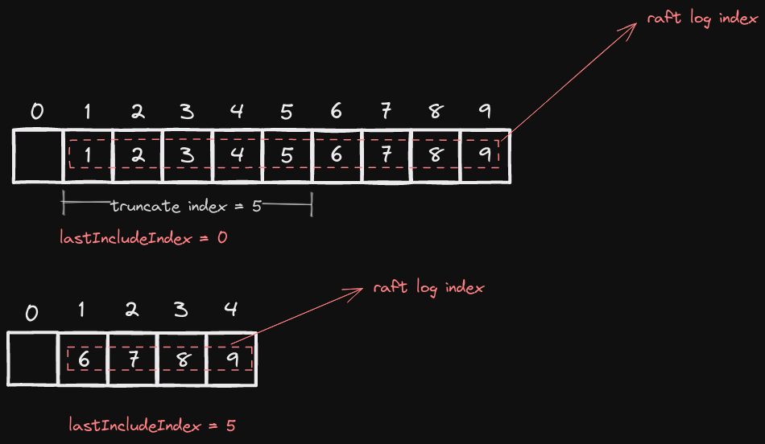

# Lab 2

- [Lab 2](#lab-2)
  - [Prerequisite](#prerequisite)
  - [Failure Classification](#failure-classification)
  - [Semantic](#semantic)
    - [RequestVote RPC](#requestvote-rpc)
    - [AppendEntries RPC](#appendentries-rpc)
    - [InstallSnapshot RPC](#installsnapshot-rpc)
    - [Persist](#persist)
    - [Snapshot](#snapshot)
    - [Slice Concurrent Issue](#slice-concurrent-issue)
  - [Optimization](#optimization)
    - [Fast rollback](#fast-rollback)
    - [Asynchronous apply](#asynchronous-apply)
    - [Optimizing sending AE](#optimizing-sending-ae)
    - [Batching](#batching)
    - [Retransmitting](#retransmitting)
  - [Others](#others)
    - [Concurrent Issue](#concurrent-issue)
    - [Threads Amplification](#threads-amplification)
    - [Limiting the number of logs in AE](#limiting-the-number-of-logs-in-ae)


## Prerequisite

`Lab 2` 的难度远高于 `Lab 1` 的难度，因此一定要仔细阅读官方提供的资料：

- [Lab 2 Instructions](http://nil.csail.mit.edu/6.5840/2023/labs/lab-raft.html)
- [Raft Paper](https://raft.github.io/raft.pdf)
- [Raft Official Website](https://raft.github.io/)
- [Student's Guide](https://thesquareplanet.com/blog/students-guide-to-raft/)
- [Effective Debug](https://blog.josejg.com/debugging-pretty/)
- [Raft Q&A](https://thesquareplanet.com/blog/raft-qa/)
- [Diagram of Interaction](http://nil.csail.mit.edu/6.5840/2023/notes/raft_diagram.pdf)

此外，我在实验过程中也查询了许多其他的资料，在此我将十分有用的列出来：

- [Raft Overview](http://thesecretlivesofdata.com/)
- [Understanding Raft](https://www.freecodecamp.org/news/in-search-of-an-understandable-consensus-algorithm-a-summary-4bc294c97e0d)
- [A series of articles on constructing Raft](https://eli.thegreenplace.net/2020/implementing-raft-part-0-introduction/)
  - [Introduction](https://eli.thegreenplace.net/2020/implementing-raft-part-0-introduction/)
  - [Elections](https://eli.thegreenplace.net/2020/implementing-raft-part-1-elections/)
  - [Log Compaction](https://eli.thegreenplace.net/2020/implementing-raft-part-2-commands-and-log-replication/)
  - [Persistence and Optimization](https://eli.thegreenplace.net/2020/implementing-raft-part-3-persistence-and-optimizations/)
- [Raft Optimization in TiKV](https://www.pingcap.com/blog/optimizing-raft-in-tikv/)

由于很多问题十分的隐蔽，因此如果被某个问题卡住的时候，可以去睡一觉或者闭上眼睛来思考这个问题，这将有助于你不局限在某些细节当中

## Failure Classification

我们首先考察我们可能遇到的问题有哪些。对于一个集群当中的机器，它会遇到以下两种问题

- `Server Crash`
- `Network Partition or Network Delay`

对于 `Crash`，我们只需要在状态更改的时候对其进行 `persist`，这个问题便可以轻松解决，重点在于 `Network` 的部分

在 `labrpc.go` 的 `processReq` 函数中，我们可以看到网络可能出现的错误

在 `RPC` 发送时有如下代码：

```go
if reliable == false {
// short delay
ms := (rand.Int() % 27)
time.Sleep(time.Duration(ms) * time.Millisecond)
}

if reliable == false && (rand.Int()%1000) < 100 {
// drop the request, return as if timeout
req.replyCh <- replyMsg{false, nil}
return
}
```

可以看到，`RPC` 从发送端到接收端**必然会延迟** `0 - 26 ms`，并且有 $10\%$ 的概率会丢包

在 `RPC` 返回时有如下代码：

```go
if replyOK == false || serverDead == true {
// server was killed while we were waiting; return error.
req.replyCh <- replyMsg{false, nil}
} else if reliable == false && (rand.Int()%1000) < 100 {
// drop the reply, return as if timeout
req.replyCh <- replyMsg{false, nil}
} else if longreordering == true && rand.Intn(900) < 600 {
// delay the response for a while
ms := 200 + rand.Intn(1+rand.Intn(2000))
// Russ points out that this timer arrangement will decrease
// the number of goroutines, so that the race
// detector is less likely to get upset.
time.AfterFunc(time.Duration(ms)*time.Millisecond, func() {
  atomic.AddInt64(&rn.bytes, int64(len(reply.reply)))
  req.replyCh <- reply
})
} else {
atomic.AddInt64(&rn.bytes, int64(len(reply.reply)))
req.replyCh <- reply
}
```

可以看到，在 `RPC` 返回时有 $10\%$ 的概率会丢包，有 $60\%$ 的概率会延迟 `200 - 2200 ms`

除此之外，哪怕不丢包，由于各个 `RPC` 会收到延迟，因此它们会**乱序到达**。换句话说，对于所有的 `RPC`，我们都需要保证其**幂等性**：如果**多个相同**的 `RPC` 先后到达，那么最终的结果等价于执行单个 `RPC`；如果新的 `RPC` 先于旧的 `RPC` 到达，那么最终的结果等价于执行新的 `RPC`

## Semantic

### RequestVote RPC

基本上，按照 `figure 2` 中所描述的那样实现，便已经保证了幂等性，我们不需要做额外的操作

### AppendEntries RPC

在对日志进行 `up-to-date` 的判断时，可以隐式地保证 `PrevLogIndex` 较大的 `RPC` 不会被 `PrevLogIndex` 较小的 `RPC` 覆盖，需要注意的是日志的添加

在我们将 `args.Entries` 添加到 `follower` 时，如果 `follower` 包含全部的 `args.Entries`，那么我们**不能截断** `follower` 的日志；如果 `args.Entries` 中有某些日志是 `follower` 没有的，我们便将那些日志添加在 `follower` 的后面；**当且仅当** `args.Entries` 与 `follower` 的日志存在冲突，我们才截断 `follower` 的日志

### InstallSnapshot RPC

在我的实现里面，完全按照 `figure 13` 无法取得正确的结果，因此这里我会加上我自己的理解

`snapshot` 的本质在于，我们将日志的某个前缀截断，然后用 `lastIncludeIndex` 和 `lastIncludeTerm` 来代替这个前缀

我将日志的 `index` 记为 `globalIndex`，而每个节点的日志索引记为 `localIndex`。在没有 `lastIncludeIndex` 时日志的初始下标从 `0 + 1` 开始，而在加上之后初始下标则从 `lastIncludeIndex + 1` 开始。因此，二者的转换关系如下：

```go
func (rf *Raft) globalIndex2LocalIndex(idx, lastIncludedIndex int) int {
	return idx - lastIncludedIndex
}

func (rf *Raft) localIndex2GlobalIndex(idx, lastIncludedIndex int) int {
	return idx + lastIncludedIndex
}
```

> 关于这里为什么需要传入 `lastIncludeIndex` 而不是直接使用 `rf.lastIncludeIndex`，我在下面的 `concurrent Issue` 部分会详细说明

关键在于初始下标从 `0` 变为 `lastIncludeIndex`，其余的一切照旧

由于 `raft` 的日志从 `1` 开始，在我的实现中所有的节点都会预先写入一个 `localIndex` 为零的空日志。在进行截断后，`localIndex` 为零的日志的 `index` 和 `term` 可以被赋值为 `lastIncludeIndex` 和 `lastIncludeTerm`，这样在 `AE` 中可以省去一些多余的逻辑



由于 `IS` 会替代一次 `AE`，因此我们需要重置 `election timeout`；除此之外，由于需要保证 `IS` 的幂等性，只有当 `args.LastIncludeIndex > rf.lastIncludeIndex`，我们才会执行 `IS RPC`

除了对日志进行阶段，`snapshot, rf.lastIncludeIndex, rf.lastIncludeTerm` 进行赋值外，我们还需要对 `rf.lastApplied` 和 `rf.commitIndex` 赋值。原因在于，一旦当前节点接受到一个新的 `snapshot`，我们便需要将这个 `snapshot` 提交给上层。而在 `config.go` 的 `ingestSnap` 函数中，有如下代码：

```go
var xlog []interface{}
if d.Decode(&lastIncludedIndex) != nil || d.Decode(&xlog) != nil {
  // other logical
  return "snapshot Decode() error"
}
if index != -1 && index != lastIncludedIndex {
  // other logical
  return err
}
// other logical
cfg.lastApplied[i] = lastIncludedIndex
```

当我们一旦提交 `snapshot` 给上层后，我们下一次提交的日志的 `globalIndex` 必须为 `lastIncludeIndex + 1`，因此 `rf.lastApplied` 需要赋值为 `args.LastIncludeIndex`；而 `rf.commitIndex` 则与 `args.LastIncludeIndex` 取较大值

对于 `leader` 而言，如果 `nextIndex <= lastIncludeIndex`，那么这个时候就需要发送一次 `IS`（这也是 `leader` 发送 `IS` 的唯一条件）。需要说明的是，这种操作其实非常普遍，因为只要 `leader` 因为上层调用 `Snapshot`，它就会更新自己的 `lastIncludeIndex`，这个时候 `nextIndex` 就无法保证总是能够大于 `lastIncludeIndex`

相应地，`leader` 发送完 `IS` 之后需要将 `nextIndex` 重置为 `lastIncludeIndex + 1`

### Persist

我们除了需要对 `currentTerm, voteFor, []log` 做 `persist` 之外，还需要对 `lastIncludeIndex, lastIncludeTerm, snapshot` 做 `persist`

额外需要注意的是，我们需要将 `lastApplied, commitIndex, nextIndex, matchIndex` 的值分别赋值成：`lastIncludeIndex, lastIncludeIndex, lastIncludeIndex + 1, lastIncludeIndex`。这是因为我们的初始值从 `0` 变为了 `lastIncludeIndex`

### Snapshot

在 `config.go` 中有如下代码：

```go
for m := range applyCh {
  err_msg := ""
  if m.SnapshotValid {
    cfg.mu.Lock()
    err_msg = cfg.ingestSnap(i, m.Snapshot, m.SnapshotIndex)
    cfg.mu.Unlock()
  } else if m.CommandValid {
    if m.CommandIndex != cfg.lastApplied[i]+1 {
      err_msg = fmt.Sprintf("server %v apply out of order, expected index %v, got %v", i, cfg.lastApplied[i]+1, m.CommandIndex)
    }
    // ...
    cfg.mu.Lock()
    cfg.lastApplied[i] = m.CommandIndex
    cfg.mu.Unlock()

    if (m.CommandIndex+1)%SnapShotInterval == 0 {
      // ...
      rf.Snapshot(m.CommandIndex, w.Bytes())
    }
  } else {
    // ...
  }
  // ...
}
```

不难发现，每固定提交 `10` 个日志就会执行一次 `snapshot`，这种设计在我的代码中产生了一个问题：

首先我在向上层提交日志的时候是没有加锁的，如果在我提交的时候，当前节点收到了来自 `leader` 的 `IS` 并更新了自己的 `lastApplied`，这便导致了我们下一次提交的日志的 `globalIndex` 必须为 `lastApplied + 1`。而我们提交日志的时候是不加锁的，因此这里必然会产生问题；如果我在提交日志的时候加锁，那么在执行到 `Snapshot` 的时候我又会再次获取一次锁，这也就导致了死锁

解决这个问题的办法是异步调用 `Snapshot`，即额外开一个 `go routine` 来执行 `Snapshot` 的操作

### Slice Concurrent Issue

当我们直接取出某个大小的 `slice` 时，我们实际上取出的是它的引用，这会造成 `data race`，这篇文章提供了更多的 [`slice trick`](https://go.dev/wiki/SliceTricks) 

```go
slice = rf.logs[idx:]

slice = make([]LogType, len(rf.logs[idx:]))
copy(slice, rf.logs[idx:])
```

## Optimization

### Fast rollback

[`Student's Guide`](https://thesquareplanet.com/blog/students-guide-to-raft/#an-aside-on-optimizations) 里面详细介绍了这个优化的实现，这里不过多赘述。其主要思想为以 `term` 为单位来回退而不是一个一个回退

### Asynchronous apply

我们可以在后台开一个线程专门用于提交日志，当条件满足时用条件变量唤醒，之后依次提交日志即可

```go
func (rf *Raft) applyLog() {
	for !rf.killed() {
		rf.mu.Lock()
		for !(rf.lastApplied < rf.commitIndex) {
			rf.commitCond.Wait()
		}
    // others
		start_lastApplied := rf.lastApplied
		entries := make([]LogType, len(rf.logs[rf.globalIndex2LocalIndex(start_lastApplied+1, rf.lastIncludeIndex):rf.globalIndex2LocalIndex(rf.commitIndex+1, rf.lastIncludeIndex)]))
    // others
			for i, log := range entries {
        // others
				msg := ApplyMsg{CommandValid: true, Command: log.Command, CommandIndex: start_lastApplied + i + 1}
				rf.tester <- msg
			}
		rf.mu.Unlock()
	}
}
```

只要当 `rf.commitIndex` 发生改变时，我们便唤醒该线程。也就是 `leader` 在 `AE` 的处理逻辑里面唤醒该线程

### Optimizing sending AE

如果不对 `AE` 的发送逻辑进行更改，那么我们每次只会在 `heartbeat timeout` 时才发送 `AE`，而 `follower` 提交日志的时间会比 `leader` 晚一个 `AE`。在最坏情况下，一个日志的同步需要等待两轮 `heartbeat timeout`

我们定义两种事件均可以发送 `AE`：

- `heartbeat` 超时
- `Start` 调用或 `rf.commitIndex` 被更新

因此，对于 `leader` 而言，我们可以额外开一个线程，等待这两个事件的发生，即：

```go
send_timer := time.NewTimer(time.Millisecond * time.Duration(heartbeat_timeout))
defer send_timer.Stop()
for !rf.killed() {
  // others
  do_send := false
  select {
  case <-send_timer.C:
    send_timer.Stop()
    send_timer.Reset(time.Millisecond * time.Duration(heartbeat_timeout))
    do_send = true
  case _, ok := <-rf.sendTrigger:
    if !ok {
      return
    }
    if !send_timer.Stop() {
      <-send_timer.C
    }
    send_timer.Reset(time.Millisecond * time.Duration(heartbeat_timeout))
    do_send = true
  }
}
```

一旦 `Start` 被调用，我们便向 `sendTrigger` 中发送一个消息，这样我们便可以马上发送一次 `AE`。此时当前日志被 `leader` 提交、被 `follower` 赋值。当 `leader` 接受到当前 `AE` 的返回结果时，会对其 `rf.commitIndex` 进行更新，此时我们再次向 `sendTrigger` 中发送消息，随后 `AE` 再次被发送，`follower` 进而会提交该日志。加入此优化后，一个日志的提交可以很快结束

### Batching

`leader` 发送过多次 `RPC` 会导致这个集群被 `RPC` 淹没，实际上 `leader` 可以缓存一些 `Start` 所添加的日志，然后一次性全部发给 `follower`。在我的实现里面，我简单的采用了通过 `timestamp` 来进行 `batch`（规定数量上限再加上超时的做法或许更好，但我选着了更为简单的策略）

### Retransmitting

前面提到，`RPC` 有可能会被丢弃，在这种情况下其实有可能会发生 [`election livelock`](https://thesquareplanet.com/blog/students-guide-to-raft/#livelocks)

只要某个 `follower` 没有收到，那么在集群中所有节点日志一致的情况下，这个 `follower` 便会成为 `leader`，此后这个循环可以一直下去

因此我们需要实现重传，保证该消息对方几乎必然可以接受到。由于丢包不可避免，但提升重传此时却可以降低丢包的概率。由于这些 `RPC` 均相同，因此只要有一个成功到达，那么由于我们实现了幂等性，我们便认为本次的 `RPC` 没有被丢失

那么剩下的问题是，重传的次数、时间间隔该如何定，以及我们是否需要等待所有的重传 `RPC` 全部返回

我们以 `AE` 的重传进行说明。由于 `leader` 会单独开多个线程来发送 `AE`，因此重传的次数和时间间隔在我看来并没有严格的限制，我定下的重传次数为 `5`，重传间隔为 `30ms`

下一个问题是，我们是否需要等待所有的重传 `RPC` 的返回。在我看来这个也不需要，`leader` 发送 `AE` 是为了保证 `follower` 不会擅自重启一轮 `election`，因此在这个意义下，`leader` 期望的是 `follower` 收到 `AE` 并重置 `election timeout`，至于日志的添加，可以交由下一次的 `AE` 处理，毕竟我们实现了 `AE` 的幂等性，多次收到同一个或者乱序收到并不会造成问题

下面是我这部分的代码，稍微需要注意的是，我们不能直接拿 `reply` 作为 `sendAppendEntries` 的参数，因为这有可能会被覆盖

```go
func (rf *Raft) retryHeartbeatMessage(obj, retry_cnt, retry_interval int, args *AppendEntriesArgs, reply *AppendEntriesReply) bool {
	ch := make(chan AppendEntriesReply, retry_cnt)
	fun := func(shutdown *atomic.Value) {
		save_reply := AppendEntriesReply{}
		if ok := rf.sendAppendEntries(obj, args, &save_reply); ok && shutdown.Load() == false {
			ch <- save_reply
		}
	}
	for i := 0; i < retry_cnt; i++ {
		var shutdown atomic.Value
		shutdown.Store(false)
		fun(&shutdown)
		select {
		case ret := <-ch:
			reply.ReplyTerm = ret.ReplyTerm
			reply.Success = ret.Success
			reply.XIndex = ret.XIndex
			reply.XTerm = ret.XTerm
			shutdown.Store(true)
			return true
		case <-time.After(time.Millisecond * time.Duration(retry_interval)):
			shutdown.Store(true)
			continue
		}
	}
	return false
}
```

## Others

### Concurrent Issue

在我加上了 `lastIncludeIndex` 之后，我发现我的 `nextIndex` 不能正确更新，总是比预期值大 `rf.lastIncludeIndex`，我的 `AE` 的处理逻辑如下：

```go
	for i := 0; i < rf.cnt; i++ {
		if i == rf.me {
			continue
		}
		go func(idx int) {
			rf.mu.Lock()
      // others
			args := AppendEntriesArgs{
        //...
			}
      rf.mu.Unlock()
			success := rf.sendAppendEntries(idx, &args, &reply)
      // others
			rf.mu.Lock()
			if success {
        // update nextIndex ...
      }
      rf.mu.Unlock()
		}(i)
  }
```

由于我们在发送 `RPC` 时不能携带锁，因此我们必然需要在这个 `go routine` 的前后两个部分分别加锁。这么做的问题在于，在中间发送 `AE` 的时候，有可能某些变量发生来更改（比如 `rf.lastIncludeIndex`），那么我们后面对 `AE` 结果进行处理时便会发生问题

解决的办法非常简单，我们只需要在这个 `go routine` 的最开始保存我们所需要的所有变量，然后一直使用拷贝即可，这也就是 `localIndex2GlobalIndex` 和 `globalIndex2LocalIndex` 需要手动传入 `lastIncludeIndex` 的原因

### Threads Amplification

由于每次 `AE` 都会开启多个线程来同时发送 `RPC`，而这多个线程均有可能更改 `rf.commitIndex`。而在我的设计中，一旦 `rf.commitIndex` 发送了更改，我们就会发送一次 `AE`。这种设计存在的问题是，会有大量的后台线程在发送 `AE` 进而导致程序执行效率缓慢（在我的电脑上，开 `-race` 的情况下，`golang` 不允许线程数超过 `8128`，~~不要问我是怎么知道的~~）。一个最简单的解决办法是，无论 `rf.commitIndex` 被更改了多少次，我们只发送一次消息给 `sendTrigger`

### Limiting the number of logs in AE

在我测试 `TestReliableChurn2C` 的时候，有的时候会出现 `failed to reach agreement` 这个问题。我检查日志的时候发现，`leader` 会向 `follower` 一次性发送上千条日志，然后 `follower` 全部复制再全部提交，导致没有 `one` 函数的测试超时。因此我考虑给 `AE` 的日志添加大小限制

需要改动的地方除了 `leader` 发送 `AE` 时规定大小外，还需要修改 `AE RPC` 的处理逻辑。在我最开始的代码中，对 `rf.commitIndex` 的更改部分如下（已省略 `lastIncludeIndex`）：

```go
if rf.commitIndex < args.LeaderCommit {
  rf.commitIndex = min(args.LeaderCommit, len(rf.logs)-1)
  rf.commitCond.Broadcast()
}
```

如果限制了 `args.Entries` 的大小的话，这一段代码是存在问题的。考虑下面这个场景，假设大小限制为 `500`，`leader` 的 `commitIndex` 为 `510`。当前 `follower` **从崩溃中恢复过后**，拥有的日志数为 `505`。当 `leader` 发送 `AE` 到该 `follower` 时，会发送下标从 `1` 到 `500` 的日志过来（由于当前节点长时间退出集群，因此 `leader` 的 `nextIndex` 被不断减少到 `1`）。然后，当前 `follower` 的前面 `500` 个日志与 `args.Entries` 相同，但后面的那 `5` 个日志则无法得到保证，换句话说后面的那 `5` 个日志有可能与 `leader` 的不一致。如果这个时候我们更新 `rf.commitIndex` 为 `args.LeaderCommit`，就会将有可能不一致的日志提交，这显然是我们不希望看到的

一个直观的想法是，让 `rf.commitIndex` 更新为 `rf.commitIndex + len(args.Entries)`，但这样无法保证幂等性（因为只要有一个 `AE` 到达，`rf.commitIndex` 就会增加）。`rf.commitIndex` 需要更新为**已确认跟 `leader` 中一致的日志的最大下标**与 `args.LeaderCommit` 的较小值，即：

```go
rf.commitIndex = min(min(conflict_index+len(args.Entries[append_index:])-1, args.LeaderCommit), len(rf.logs)-1)
```

在这里，`conflict_index` 和 `append_index` 分别表示 `rf.logs` 与 `args.Entries` 冲突的下标

或许还有另外一种办法是限制一次提交日志的数量，但我并没有实现这个，所以不在此处讨论


